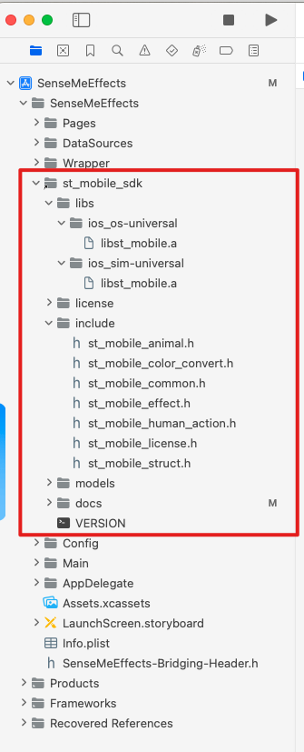
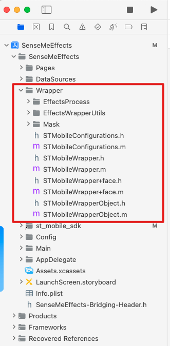

# 1 SDK集成

## 1.1 导入SDK
导入SenseME Effects iOS SDK头文件、静态库文件（.a）。



## 1.2 添加链接库
SenseME Effects依赖C++，在TARGETS -> Build Settings -> Linking -> Other LinkerFlags中添加`-lc++`。

## 1.3 (仅GAN功能版本)链接`CoreML.framework`
TARGETS -> Build Phases -> Link Binary With Libraries -> 添加`CoreML.framework`。
> 由于SDK中GAN磨皮功能依赖CoreML，需要在Xcode 15.3及以上版本Xcode中进行开发。

## 1.4 关闭Bitcode
SenseMe Effects不支持Bitcode，将TARGETS -> Build Settings -> Build Options -> Enable Bitcode 设置为 `NO`。

## 1.5 导入配套的Objective-C封装
将Wrapper文件夹导入工程。



## 1.6 Metal版本集成
将st_mobile_sdk/angle中的libEGL.framework和libGLESv2.framework embed。

# 2 SDK基本功能
SDK基本功能接口都集中在`STMobileWrapper.h`中。
## 2.1 初始化
- OpenGL ES
```objective-c
-(instancetype)initWithConfig:(NSDictionary *)config context:(nullable EAGLContext *)context error:(NSError **)error NS_DESIGNATED_INITIALIZER;
```

- Metal
```objective-c
-(instancetype)initMetalWrapperWithConfig:(NSDictionary *)config error:(NSError **)error;
```

参数说明：
- `config`: 初始化相关配置：
```objective-c
@{
    @"license": [NSBundle.mainBundle pathForResource:@"SENSEME" ofType:@"lic"], 
    @"config": @(config), 
    @"models": firstLoadArray // 
}
```
    - license：文件路径；
    - config：相机预览、视频处理、照片处理使用不同的config，见STMobileWrapperConfig枚举；
    - models：可选，传入初始化时加载的检测模型路径的数组（初始化后也可通过相应接口按需加载模型）。

- `context`: GL Context，传`nil`则内部维护context，如果传入则使用传入的context（一般情况下，在之后的process接口中如果需要获得纹理，则context需要外部传入）。

## 2.2 加载模型
```objective-c
-(void)addSubModel:(NSString *)path error:(NSError **)error;
```

参数说明：
- `path`: 模型文件的路径。

## 2.3 SDK参数设置
```objective-c
-(void)setEffectsParam:(st_effect_param_t)param value:(CGFloat)value error:(NSError **)error;
```

参数说明：
- `param`: 需要设置的参数：
```objective-c
typedef enum {
    EFFECT_PARAM_MIN_FRAME_INTERVAL,        ///< \~chinese 贴纸前后两个序列帧切换的最小时间间隔，单位为毫秒。当两个相机帧处理的间隔小于这个值的时候，当前显示的贴纸序列帧会继续显示，直到显示的时间大于该设定值贴纸才会切换到下一阵，相机帧不受影响。 \~english The minimum time interval between two sequential frames of stickers, in milliseconds. When the interval between two camera frame processing is less than this value, the current displayed sticker sequential frame will continue to display until the displayed time is greater than this set value, and then the sticker will switch to the next formation, and the camera frame will not be affected.

    EFFECT_PARAM_MAX_MEMORY_BUDGET_MB,      ///< \~chinese 设置贴纸素材资源所占用的最大内存（MB），当估算内存超过这个值时，将不能再加载新的素材包 \~english Set the maximum memory (MB) occupied by sticker material resources. When the estimated memory exceeds this value, new material packages can no longer be loaded.

    EFFECT_PARAM_QUATERNION_SMOOTH_FRAME,   ///< \~chinese 设置相机姿态平滑参数，表示平滑多少帧, 越大延迟越高，抖动越微弱 \~english Set camera attitude smoothing parameters, indicating how many frames to smooth, the larger the delay, the weaker the jitter.

    EFFECT_PARAM_USE_INPUT_TIMESTAMP,       ///< \~chinese 设置贴纸是否使用外部时间戳更新 \~english Set whether the sticker uses an external timestamp update

    EFFECT_PARAM_PREFER_MEMORY_CACHE,       ///< \~chinese 倾向于空间换时间，传0的话，则尽可能清理内部缓存，保持内存最小。目前主要影响3D共享资源 \~english Prefer space for time. If 0 is passed, it will clean up the internal cache as much as possible to keep the memory at a minimum. Currently, it mainly affects 3D shared resources.

    EFFECT_PARAM_DISABLE_BEAUTY_OVERLAP,    ///< \~chinese 传入大于0的值，禁用美颜Overlap逻辑（贴纸中的美颜会覆盖前面通过API或者贴纸生效的美颜效果，贴纸成组覆盖，API单个覆盖），默认启用Overlap \~english Enter a value greater than 0 to disable the beauty overlap logic (the beauty in the sticker will cover the beauty effect that has taken effect through the API or the sticker, the stickers are overlapped in groups, and the API is overlapped individually), overlap is enabled by default

    EFFECT_PARAM_DISABLE_MODULE_REORDER,    ///< \~chinese 传入大于0的值，禁用对于v3.1之前的素材包重新排序module的渲染顺序，该选项只会影响设置之后添加的素材。重新排序是为了在与美妆、风格素材包叠加时达到最佳效果，默认启用ReOrder \~english Input a value greater than 0 to disable the rendering order reordering of modules for material packages prior to v3.1. This option will only affect materials added after setting. The reorder is to achieve the best effect when overlaying with beauty makeup and style material packages, ReOrder is enabled by default.

    EFFECT_PARAM_3D_POSE_SOLUTION,          ///< \~chinese 3DPose计算方案，传入0使用106旧模型方案，传1使用基于282模型优化的Pose方案，默认值为1 \~english 3DPose calculation solution, input 0 to use the old 106 model solution, input 1 to use the Pose solution optimized based on the 282 model, the default value is 1.

    EFFECT_PARAM_RENDER_DELAY_FRAME,        ///< \~chinese 设置未来帧帧数，默认值是0, 需要是大于等于0的值，0表示不开未来帧 \~english Set the number of future frames, the default value is 0, it needs to be a value greater than or equal to 0, 0 indicates that future frames are not opened.

    EFFECT_PARAM_GREEN_COLOR_BALANCE,       ///< \~chinese 设置去绿程度，0表示不去绿，1表示最大程度去绿，默认值为1 \~english Set the degree of green removal, 0 indicates no green removal, 1 indicates the maximum degree of green removal, the default value is 1.

    EFFECT_PARAM_GREEN_SPILL_BY_ALPHA,      ///< \~chinese 设置去绿色彩平衡, 和去绿程度配套使用, 平衡因去绿导致的主体颜色变化, 范围[0.0, 1.0], 默认0.5(不进行平衡) \~english Set green removal color balance, used in conjunction with green removal intensity to balance the color change caused by green removal. Range [0.0, 1.0], default 0.5 (no balance).

    EFFECT_PARAM_PLASTIC_FACE_OCCLUSION,    ///< \~chinese 微整形效果遮挡，目前支持白牙、亮眼，默认值为0, 表示没有效果遮挡，1表示开启效果遮挡 \~english MicroPlastic effect occlusion, and currently supports teeth whitening and eye brightening. default value is 0, means no effect occlusion, 1 means open effect occlusion.

    EFFECT_PARAM_MAKEUP_PERFORMANCE_HINT,   ///< \~chinese 设置美妆性能/效果优先级倾向，性能优先适用于多人脸的场景，引擎内部会根据设置调整渲染策略, 0表示效果优先， 1表示性能优先，默认值为0 \~english Configure the priority preference for makeup performance/effects. Performance priority is suitable for scenarios with multiple faces, and the engine internally will adjust the rendering strategy according to the setting. A value of 0 indicates a preference for effects, while a value of 1 indicates a preference for performance. The default value is 0.
} st_effect_param_t;
```

- `value`: 设置参数的值。

## 2.4 贴纸、风格妆
### 2.4.1 添加/切换贴纸
```objective-c
-(int)changePackage:(NSString *)packagePath error:(NSError **)error;
```

参数说明：
- packagePath`: 贴纸素材包的路径；
- 返回值：素材包id（通过id可以移除贴纸、修改其中某些参数、动画贴纸重新播放等）。

### 2.4.2 移除指定贴纸
```objective-c
-(void)removePackage:(int)packageId error:(NSError **)error;
```

参数说明：
- `packageId`: 添加素材包时获取的id。

### 2.4.3 移除所有添加的贴纸
```objective-c
-(void)clearPackagesError:(NSError **)error;
```

### 2.4.4 修改风格强度
```objective-c
-(void)setPackageBeautyGroup:(int)packageId type:(st_effect_beauty_group_t)type strength:(CGFloat)strength error:(NSError **)error;
```

参数说明：
- `packageId`: 添加素材包时获取的id；
- `type`: 修改风格的哪种类型参数（美妆or滤镜…）：
```objective-c
typedef enum {
    EFFECT_BEAUTY_GROUP_BASE,           ///< \~chinese 基础美颜组 \~english Basic beauty group
    EFFECT_BEAUTY_GROUP_RESHAPE,        ///< \~chinese 美型组 \~english Reshape group
    EFFECT_BEAUTY_GROUP_PLASTIC,        ///< \~chinese 微整形组 \~english Micro Plastic group
    EFFECT_BEAUTY_GROUP_TONE,           ///< \~chinese 图像微调组 \~english Tone adjustment group
    EFFECT_BEAUTY_GROUP_MAKEUP,         ///< \~chinese 美妆组 \~english Makeup group
    EFFECT_BEAUTY_GROUP_FILTER,         ///< \~chinese 滤镜组 \~english Filter group
} st_effect_beauty_group_t;
```
- `strength`: 需要修改的强度。

### 2.4.5 贴纸重播
```objective-c
-(void)replayPackage:(int)packageId error:(NSError **)error;
```

参数说明：
- `packageId`: 添加素材包时获取的id。

## 2.5 美妆、美颜、滤镜
一般使用流程：加载素材包（若有）-> 设置强度。
### 2.5.1 设置素材包
一般美妆、滤镜都会有素材包，某些美颜也需要先加载素材包。
```objective-c
-(void)setBeautyPath:(st_effect_beauty_type_t)type path:(nullable NSString *)path error:(NSError **)error;
```

参数说明：
- `type`:类型：
```objective-c
typedef enum {
    // \~chinese 基础美颜 base
    // \~english Basic beauty
    EFFECT_BEAUTY_BASE_WHITTEN                      = 101,  ///< \~chinese 美白，[0,1.0], 默认值0.30, 0.0不做美白 \~english Whitening, [0,1.0], default value 0.30, 0.0 means no whitening
    EFFECT_BEAUTY_BASE_REDDEN                       = 102,  ///< \~chinese 红润, [0,1.0], 默认值0.36, 0.0不做红润 \~english Redden, [0,1.0], default value 0.36, 0.0 means no reddening
    EFFECT_BEAUTY_BASE_FACE_SMOOTH                  = 103,  ///< \~chinese 磨皮, [0,1.0], 默认值0.74, 0.0不做磨皮 \~english Face smoothing, [0,1.0], default value 0.74, 0.0 means no face smoothing

    // \~chinese 美形 reshape
    // \~english Beauty reshaping
    EFFECT_BEAUTY_RESHAPE_SHRINK_FACE               = 201,  ///< \~chinese 瘦脸, [0,1.0], 默认值0.11, 0.0不做瘦脸效果 \~english Face slimming, [0,1.0], default value 0.11, 0.0 means no face slimming effect
    EFFECT_BEAUTY_RESHAPE_ENLARGE_EYE               = 202,  ///< \~chinese 大眼, [0,1.0], 默认值0.13, 0.0不做大眼效果 \~english Eye enlargement, [0,1.0], default value 0.13, 0.0 means no eye enlargement effect
    EFFECT_BEAUTY_RESHAPE_SHRINK_JAW                = 203,  ///< \~chinese 小脸, [0,1.0], 默认值0.10, 0.0不做小脸效果 \~english Jaw slimming, [0,1.0], default value 0.10, 0.0 means no jaw slimming effect
    EFFECT_BEAUTY_RESHAPE_NARROW_FACE               = 204,  ///< \~chinese 窄脸, [0,1.0], 默认值0.0, 0.0不做窄脸 \~english Narrow face, [0,1.0], default value 0.0, 0.0 means no narrow face effect
    EFFECT_BEAUTY_RESHAPE_ROUND_EYE                 = 205,  ///< \~chinese 圆眼, [0,1.0], 默认值0.0, 0.0不做圆眼 \~english Round eyes, [0,1.0], default value 0.0, 0.0 means no round eyes effect

    // \~chinese 微整形 plastic
    // \~english Micro Plastic
    EFFECT_BEAUTY_PLASTIC_THINNER_HEAD              = 301,  ///< \~chinese 小头, [0, 1.0], 默认值0.0, 0.0不做小头效果 \~english Smaller head, [0, 1.0], default value 0.0, 0.0 means no smaller head effect
    EFFECT_BEAUTY_PLASTIC_THIN_FACE                 = 302,  ///< \~chinese 瘦脸型，[0,1.0], 默认值0.0, 0.0不做瘦脸型效果 \~english Thinner face shape, [0,1.0], default value 0.0, 0.0 means no thinner face shape effect
    EFFECT_BEAUTY_PLASTIC_CHIN_LENGTH               = 303,  ///< \~chinese 下巴，[-1, 1], 默认值为0.0，[-1, 0]为短下巴，[0, 1]为长下巴 \~english Chin length, [-1, 1], default value is 0.0, [-1, 0] means shorter chin, [0, 1] means longer chin
    EFFECT_BEAUTY_PLASTIC_HAIRLINE_HEIGHT           = 304,  ///< \~chinese 额头，[-1, 1], 默认值为0.0，[-1, 0]为低发际线，[0, 1]为高发际线 \~english Hairline height, [-1, 1], default value is 0.0, [-1, 0] means lower hairline, [0, 1] means higher hairline
    EFFECT_BEAUTY_PLASTIC_APPLE_MUSLE               = 305,  ///< \~chinese 苹果肌，[0, 1.0]，默认值为0.0，0.0不做苹果肌 \~english Apple muscle, [0, 1.0], default value is 0.0, 0.0 means no apple muscle effect
    EFFECT_BEAUTY_PLASTIC_NARROW_NOSE               = 306,  ///< \~chinese 瘦鼻翼，[0, 1.0], 默认值为0.0，0.0不做瘦鼻 \~english Narrow nose wings, [0, 1.0], default value is 0.0, 0.0 means no narrow nose wings effect
    EFFECT_BEAUTY_PLASTIC_NOSE_LENGTH               = 307,  ///< \~chinese 长鼻，[-1, 1], 默认值为0.0, [-1, 0]为短鼻，[0, 1]为长鼻 \~english Longer nose, [-1, 1], default value is 0.0, [-1, 0] means shorter nose, [0, 1] means longer nose
    EFFECT_BEAUTY_PLASTIC_PROFILE_RHINOPLASTY       = 308,  ///< \~chinese 侧脸隆鼻，[0, 1.0]，默认值为0.0，0.0不做侧脸隆鼻效果 \~english Profile rhinoplasty, [0, 1.0], default value is 0.0, 0.0 means no profile rhinoplasty effect
    EFFECT_BEAUTY_PLASTIC_MOUTH_SIZE                = 309,  ///< \~chinese 嘴型，[-1, 1]，默认值为0.0，[-1, 0]为放大嘴巴，[0, 1]为缩小嘴巴 \~english Mouth shape, [-1, 1], default value is 0.0, [-1, 0] means larger mouth, [0, 1] means smaller mouth
    EFFECT_BEAUTY_PLASTIC_PHILTRUM_LENGTH           = 310,  ///< \~chinese 缩人中，[-1, 1], 默认值为0.0，[-1, 0]为长人中，[0, 1]为短人中 \~english Philtrum length, [-1, 1], default value is 0.0, [-1, 0] means longer philtrum, [0, 1] means shorter philtrum
    EFFECT_BEAUTY_PLASTIC_EYE_DISTANCE              = 311,  ///< \~chinese 眼距，[-1, 1]，默认值为0.0，[-1, 0]为减小眼距，[0, 1]为增加眼距 \~english Eye distance, [-1, 1], default value is 0.0, [-1, 0] means reducing eye distance, [0, 1] means increasing eye distance
    EFFECT_BEAUTY_PLASTIC_EYE_ANGLE                 = 312,  ///< \~chinese 眼睛角度，[-1, 1]，默认值为0.0，[-1, 0]为左眼逆时针旋转，[0, 1]为左眼顺时针旋转，右眼与左眼相对 \~english Eye angle, [-1, 1], default value is 0.0, [-1, 0] means rotating left eye counterclockwise, [0, 1] means rotating left eye clockwise, relative to right eye
    EFFECT_BEAUTY_PLASTIC_OPEN_CANTHUS              = 313,  ///< \~chinese 开眼角，[0, 1.0]，默认值为0.0， 0.0不做开眼角 \~english Eye opening, [0, 1.0], default value is 0.0, 0.0 means no eye opening effect
    EFFECT_BEAUTY_PLASTIC_BRIGHT_EYE                = 314,  ///< \~chinese 亮眼，[0, 1.0]，默认值为0.0，0.0不做亮眼 \~english Brighten eyes, [0, 1.0], default value is 0.0, 0.0 means no eye brightening effect
    EFFECT_BEAUTY_PLASTIC_REMOVE_DARK_CIRCLES       = 315,  ///< \~chinese 祛黑眼圈，[0, 1.0]，默认值为0.0，0.0不做去黑眼圈 \~english Remove dark circles, [0, 1.0], default value is 0.0, 0.0 means no dark circles removal effect
    EFFECT_BEAUTY_PLASTIC_REMOVE_NASOLABIAL_FOLDS   = 316,  ///< \~chinese 祛法令纹，[0, 1.0]，默认值为0.0，0.0不做去法令纹 \~english Remove nasolabial folds, [0, 1.0], default value is 0.0, 0.0 means no nasolabial folds removal effect
    EFFECT_BEAUTY_PLASTIC_WHITE_TEETH               = 317,  ///< \~chinese 白牙，[0, 1.0]，默认值为0.0，0.0不做白牙 \~english White teeth, [0, 1.0], default value is 0.0, 0.0 means no teeth whitening effect
    EFFECT_BEAUTY_PLASTIC_SHRINK_CHEEKBONE          = 318,  ///< \~chinese 瘦颧骨， [0, 1.0], 默认值0.0， 0.0不做瘦颧骨 \~english Shrink cheekbones, [0, 1.0], default value is 0.0, 0.0 means no cheekbone shrinking effect
    EFFECT_BEAUTY_PLASTIC_OPEN_EXTERNAL_CANTHUS     = 319,  ///< \~chinese 开外眼角比例，[0, 1.0]，默认值为0.0， 0.0不做开外眼角 \~english Open external canthus, [0, 1.0], default value is 0.0, 0.0 means no opening of the outer canthus effect
    EFFECT_BEAUTY_PLASTIC_SHRINK_JAWBONE            = 320,  ///< \~chinese 瘦下颔，[0, 1.0], 默认值0.0， 0.0不做瘦下颔 \~english Shrink jawbone, [0, 1.0], default value is 0.0, 0.0 means no jawbone shrinking effect
    EFFECT_BEAUTY_PLASTIC_SHRINK_ROUND_FACE         = 321,  ///< \~chinese 圆脸瘦脸，[0, 1.0], 默认值0.0， 0.0不做瘦脸 \~english Shrink round face, [0, 1.0], default value is 0.0, 0.0 means no face slimming effect for round face
    EFFECT_BEAUTY_PLASTIC_SHRINK_LONG_FACE          = 322,  ///< \~chinese 长脸瘦脸，[0, 1.0], 默认值0.0， 0.0不做瘦脸 \~english Shrink long face, [0, 1.0], default value is 0.0, 0.0 means no face slimming effect for long face
    EFFECT_BEAUTY_PLASTIC_SHRINK_GODDESS_FACE       = 323,  ///< \~chinese 女神瘦脸，[0, 1.0], 默认值0.0， 0.0不做瘦脸 \~english Shrink goddess face, [0, 1.0], default value is 0.0, 0.0 means no face slimming effect for goddess face
    EFFECT_BEAUTY_PLASTIC_SHRINK_NATURAL_FACE       = 324,  ///< \~chinese 自然瘦脸，[0, 1.0], 默认值0.0， 0.0不做瘦脸 \~english Shrink natural face, [0, 1.0], default value is 0.0, 0.0 means no face slimming effect for natural face
    EFFECT_BEAUTY_PLASTIC_SHRINK_WHOLE_HEAD         = 325,  ///< \~chinese 整体缩放小头，[0, 1.0], 默认值0.0, 0.0不做整体缩放小头效果 \~english Shrink the whole head, [0, 1.0], default value is 0.0, 0.0 means no shrinking of the whole head effect
    EFFECT_BEAUTY_PLASTIC_EYE_HEIGHT                = 326,  ///< \~chinese 眼睛位置比例，[-1, 1]，默认值0.0, [-1, 0]向下移动眼睛，[0, 1]向上移动眼睛 \~english Eye position ratio, [-1, 1], default value is 0.0, [-1, 0] means moving eyes downward, [0, 1] means moving eyes upward
    EFFECT_BEAUTY_PLASTIC_MOUTH_CORNER              = 327,  ///< \~chinese 嘴角上移比例，[0, 1.0]，默认值0.0, 0.0不做嘴角调整 \~english Mouth corner lifting ratio, [0, 1.0], default value is 0.0, 0.0 means no mouth corner adjustment
    EFFECT_BEAUTY_PLASTIC_HAIRLINE                  = 328,  ///< \~chinese 新发际线高低比例，[-1, 1]，默认值0.0, [-1, 0]为低发际线，[0, 1]为高发际线 \~english Hairline height ratio, [-1, 1], default value is 0.0, [-1, 0] means lower hairline, [0, 1] means higher hairline

    // \~chinese 调整 tone
    // \~english Tone adjustment
    EFFECT_BEAUTY_TONE_CONTRAST                     = 601,  ///< \~chinese 对比度, [0,1.0], 默认值0.05, 0.0不做对比度处理 \~english Contrast, [0,1.0], default value 0.05, 0.0 means no contrast adjustment
    EFFECT_BEAUTY_TONE_SATURATION                   = 602,  ///< \~chinese 饱和度, [0,1.0], 默认值0.10, 0.0不做饱和度处理 \~english Saturation, [0,1.0], default value 0.10, 0.0 means no saturation adjustment
    EFFECT_BEAUTY_TONE_SHARPEN                      = 603,  ///< \~chinese 锐化, [0, 1.0], 默认值0.0, 0.0不做锐化 \~english Sharpening, [0, 1.0], default value 0.0, 0.0 means no sharpening
    EFFECT_BEAUTY_TONE_CLEAR                        = 604,  ///< \~chinese 清晰度, 清晰强度, [0,1.0], 默认值0.0, 0.0不做清晰 \~english Clarity, clarity strength, [0,1.0], default value 0.0, 0.0 means no clarity adjustment
    EFFECT_BEAUTY_TONE_BOKEH                        = 605,  ///< \~chinese 背景虚化强度, [0,1.0], 默认值0.0, 0.0不做背景虚化 \~english Bokeh intensity, [0,1.0], default value 0.0, 0.0 means no bokeh effect
    EFFECT_BEAUTY_TONE_DENOISING                    = 606,  ///< \~chinese 去噪，[0, 1.0], 默认值0.0, 0.0不做去噪处理 \~english denoising intensity, [0, 1.0], default value 0.0 means off
    EFFECT_BEAUTY_TONE_COLOR_TONE                   = 607,  ///< \~chinese 色调，[-1.0, 1.0], 默认值0.0, 0.0不做色调处理 \~english Color tone adjustment, [-1.0, 1.0], default value 0.0 means off
    EFFECT_BEAUTY_TONE_COLOR_TEMPERATURE            = 608,  ///< \~chinese 色温，[-1.0, 1.0], 默认值0.0, 0.0不做色温处理 \~english Color tempareture adjustment, [-1.0, 1.0], default value 0.0 means off

    // \~chinese 美妆 makeup
    // \~english Makeup
    EFFECT_BEAUTY_MAKEUP_HAIR_DYE                   = 401,  ///< \~chinese 染发 \~english Hair dye
    EFFECT_BEAUTY_MAKEUP_LIP                        = 402,  ///< \~chinese 口红 \~english Lipstick
    EFFECT_BEAUTY_MAKEUP_CHEEK                      = 403,  ///< \~chinese 腮红 \~english Blush
    EFFECT_BEAUTY_MAKEUP_NOSE                       = 404,  ///< \~chinese 修容 \~english Nose contouring
    EFFECT_BEAUTY_MAKEUP_EYE_BROW                   = 405,  ///< \~chinese 眉毛 \~english Eyebrow
    EFFECT_BEAUTY_MAKEUP_EYE_SHADOW                 = 406,  ///< \~chinese 眼影 \~english Eyeshadow
    EFFECT_BEAUTY_MAKEUP_EYE_LINE                   = 407,  ///< \~chinese 眼线 \~english Eyeliner
    EFFECT_BEAUTY_MAKEUP_EYE_LASH                   = 408,  ///< \~chinese 眼睫毛 \~english Eyelash
    EFFECT_BEAUTY_MAKEUP_EYE_BALL                   = 409,  ///< \~chinese 美瞳 \~english Eye color
    EFFECT_BEAUTY_MAKEUP_PACKED                     = 410,  ///< \~chinese 打包的美妆素材，可能包含一到多个单独的美妆模块，与其他单独美妆可以同时存在 \~english Packed makeup material, may contain one or more individual makeup modules, can coexist with other individual makeups
    EFFECT_BEAUTY_MAKEUP_EYE_PAINTING               = 411,  ///< \~chinese 眼妆 \~english Eye painting

    EFFECT_BEAUTY_FILTER                            = 501,  ///< \~chinese 滤镜 \~english Filter

    // \~chinese 试妆 tryon
    // \~english Makeup tryon
    EFFECT_BEAUTY_TRYON_HAIR_COLOR                  = 701,  ///< \~chinese 染发，可设置的参数包括：颜色，强度，明暗度，高光 \~english Hair dye, configurable parameters include: color, intensity, brightness, highlight
    EFFECT_BEAUTY_TRYON_LIPSTICK                    = 702,  ///< \~chinese 口红，可设置的参数包括：颜色，强度，高光(特定材质：水润、闪烁、金属)，质地类型 \~english Lipstick, configurable parameters include: color, intensity, highlight (specific textures: moisturizing, shimmering, metallic), texture type
    EFFECT_BEAUTY_TRYON_LIPLINE                     = 703,  ///< \~chinese 唇线，可设置的参数包括：颜色，强度，唇线线宽 \~english Lip line, configurable parameters include: color, intensity, lip line width
    EFFECT_BEAUTY_TRYON_BLUSH                       = 704,  ///< \~chinese 腮红，可设置的参数包括：颜色，强度 \~english Blush, configurable parameters include: color, intensity
    EFFECT_BEAUTY_TRYON_BROW                        = 705,  ///< \~chinese 眉毛，可设置的参数包括：颜色，强度 \~english Eyebrow, configurable parameters include: color, intensity
    EFFECT_BEAUTY_TRYON_FOUNDATION                  = 706,  ///< \~chinese 粉底，可设置的参数包括：颜色，强度 \~english Foundation, configurable parameters include: color, intensity
    EFFECT_BEAUTY_TRYON_CONTOUR                     = 707,  ///< \~chinese 修容，可设置的参数包括：强度（整体），区域信息（区域id，颜色，强度） \~english Contouring, configurable parameters include: intensity (overall), area information (area id, color, intensity)
    EFFECT_BEAUTY_TRYON_EYESHADOW                   = 708,  ///< \~chinese 眼影，可设置的参数包括：强度（整体），区域信息（区域id，颜色，强度） \~english Eyeshadow, configurable parameters include: intensity (overall), area information (area id, color, intensity)
    EFFECT_BEAUTY_TRYON_EYELINER                    = 709,  ///< \~chinese 眼线，可设置的参数包括：强度（整体），区域信息（区域id，颜色，强度） \~english Eyeliner, configurable parameters include: intensity (overall), area information (area id, color, intensity)
    EFFECT_BEAUTY_TRYON_EYELASH                     = 710,  ///< \~chinese 眼睫毛，可设置的参数包括：颜色，强度 \~english Eyelash, configurable parameters include: color, intensity
    EFFECT_BEAUTY_TRYON_STAMPLINER                  = 711,  ///< \~chinese 眼印，可设置的参数包括：颜色，强度 \~english Eye stamp, configurable parameters include: color, intensity

    // \~chinese 3D 微整形
    // \~english 3D micro plastic
    EFFECT_BEAUTY_3D_MICRO_PLASTIC                  = 801,
} st_effect_beauty_type_t;
```

- `path`: 素材包路径。

### 2.5.2 设置mode
类似美白、磨皮通过mode来区分使用不同类型的美白。
```objective-c
-(void)setBeautyMode:(st_effect_beauty_type_t)type mode:(int)mode error:(NSError **)error;
```

参数说明：
- `type`: 类型（见2.5.1）；
- `mode`: 需要设置的mode。

美白mode
```objective-c
/// \~chinese
/// @brief 美白模式，主要有 3 种不同的美白效果，同时兼容了老的美白效果
/// \~english
/// @brief whiten mode, four modes supported
typedef enum {
    EFFECT_WHITEN_1      = 0,      ///< \~chinese 美白1 \~english mode 1
    EFFECT_WHITEN_2      = 1,      ///< \~chinese 美白2 \~english mode 2
    EFFECT_WHITEN_3      = 2,      ///< \~chinese 美白3 \~english mode 3
    EFFECT_WHITEN_LEGACY = 3,      ///< \~chinese 老美白效果 \~english legacy mode.
} st_effect_whiten_mode;
```

磨皮mode
```objective-c
/// \~chinese
/// @brief 磨皮模式
/// \~english
/// @brief smooth mode supported
typedef enum {
    EFFECT_SMOOTH_FACE_ONLY     = 0,      ///< \~chinese 只针对人脸做磨皮处理 \~english smooth only on face
    EFFECT_SMOOTH_FULL_IMAGE    = 1,      ///< \~chinese 对全图做磨皮处理 \~english whole image smooth
    EFFECT_SMOOTH_FACE_DETAILED = 2,      ///< \~chinese 针对脸部做精细化磨皮处理 \~english high quality smooth on face
    EFFECT_SMOOTH_FACE_REFINE   = 3,      ///< \~chinese 对脸部皮肤细化和改善质感的磨皮处理 \~english refining and improving the texture of facial skin
} st_effect_smooth_mode;
```

### 2.5.3 设置强度
```objective-c
-(void)setBeautyStrength:(st_effect_beauty_type_t)type strength:(CGFloat)strength error:(NSError **)error;
```

参数说明：
- `type`: 类型（见2.5.1）；
- `strength`: 需要设置的强度（范围见2.5.1）。

### 2.5.4 设置参数
```objective-c
-(void)setBeautyParam:(st_effect_beauty_param_t)type value:(CGFloat)value error:(NSError **)error;
```

参数说明：
- `type`: 类型:
```objective-c
typedef enum {
    EFFECT_BEAUTY_PARAM_ENABLE_WHITEN_SKIN_MASK,         ///< \~chinese 是否为美白开启皮肤分割, 默认为不启用. 0 表示不启用， 非0表示启用 \~english Whether to enable skin segmentation for whitening. Disabled by default. 0 means disabled, non-zero means enabled.
} st_effect_beauty_param_t;
```
- `value`: 需要设置的强度。

### 2.5.5 3D微整形
在设置3D微整形前需要先通过2.5.1加载3D微整形素材包，然后获取其所有支持的3D微整形信息数组，然后修改其中某一个或多个的强度。
#### 2.5.5.1 获取3D微整形信息
```objective-c
-(NSArray<STMobileEffect3DBeautyPartInfo *> *)get3dBeautyPartsError:(NSError **)error;
```
建议缓存3D微整形信息。

#### 2.5.5.2 设置3D微整形强度
```objective-c
-(void)set3dBeautyPartStrength:(STMobileEffect3DBeautyPartInfo *)part error:(NSError **)error;
```

参数说明：
- `part`: 2.5.5.1中获取的数组，修改其中某一个part info的强度并传入此接口。

### 2.5.6 Tryon
#### 2.5.6.1 获取Tryon信息
```objective-c
-(STMobileEffectTryonInfo *)getTryonParam:(st_effect_beauty_type_t)type error:(NSError **)error;
```

#### 2.5.6.2 设置Tryon
```objective-c
-(void)setTryon:(st_effect_beauty_type_t)type param:(STMobileEffectTryonInfo *)param error:(NSError **)error;
```

参数说明：
- `param`: 2.5.6.2中获取的数组，修改其中的某些参数传入此接口。

## 2.6 Process
在2.5中设置了某些效果后，将pixel buffer传入如下接口会得到添加了特效后的图像数据。提供输入pixel buffer输出pixel buffer以及输入pixel buffer输出texture两种接口，其中，输出texture需要在初始化时传入GL context。

### 2.6.1 返回pixel buffer
```objective-c
-(void)processByPixelBuffer:(CVPixelBufferRef)pixelBuffer rotate:(st_rotate_type)rotate captureDevicePosition:(AVCaptureDevicePosition)position outputPixelBuffer:(CVPixelBufferRef *)outputPixelBuffer error:(NSError **)error;

```
参数说明：
- `pixelBuffer`: 输入的原始图像的pixel buffer；
- `rotate`: 图像的旋转角度
```objective-c
typedef enum {
    ST_CLOCKWISE_ROTATE_0 = 0,  ///< \~chinese 图像不需要旋转,图像中的人脸为正脸 \~english Image does not need to be rotated, the face in the image is upright
    ST_CLOCKWISE_ROTATE_90 = 1, ///< \~chinese 图像需要顺时针旋转90度,使图像中的人脸为正 \~english Image needs to be rotated clockwise by 90 degrees to make the face in the image upright
    ST_CLOCKWISE_ROTATE_180 = 2,///< \~chinese 图像需要顺时针旋转180度,使图像中的人脸为正 \~english Image needs to be rotated clockwise by 180 degrees to make the face in the image upright
    ST_CLOCKWISE_ROTATE_270 = 3 ///< \~chinese 图像需要顺时针旋转270度,使图像中的人脸为正 \~english Image needs to be rotated clockwise by 270 degrees to make the face in the image upright
} st_rotate_type;
```
- `position`: 当前使用的是前后摄像头
```objective-c
typedef NS_ENUM(NSInteger, AVCaptureDevicePosition) {
    AVCaptureDevicePositionUnspecified = 0,
    AVCaptureDevicePositionBack        = 1,
    AVCaptureDevicePositionFront       = 2,
} API_AVAILABLE(macos(10.7), ios(4.0), macCatalyst(14.0)) API_UNAVAILABLE(tvos) API_UNAVAILABLE(watchos);
```
- `outputPixelBuffer`: 外部创建的用来承载处理结果的pixel buffer指针。

```objective-c
-(CVPixelBufferRef)processGetBufferByPixelBuffer:(CVPixelBufferRef)pixelBuffer rotate:(st_rotate_type)rotate captureDevicePosition:(AVCaptureDevicePosition)position error:(NSError **)error;
```
参数说明：
- `pixelBuffer`: 输入的原始图像的pixel buffer；
- `rotate`: 图像的旋转角度
```objective-c
typedef enum {
    ST_CLOCKWISE_ROTATE_0 = 0,  ///< \~chinese 图像不需要旋转,图像中的人脸为正脸 \~english Image does not need to be rotated, the face in the image is upright
    ST_CLOCKWISE_ROTATE_90 = 1, ///< \~chinese 图像需要顺时针旋转90度,使图像中的人脸为正 \~english Image needs to be rotated clockwise by 90 degrees to make the face in the image upright
    ST_CLOCKWISE_ROTATE_180 = 2,///< \~chinese 图像需要顺时针旋转180度,使图像中的人脸为正 \~english Image needs to be rotated clockwise by 180 degrees to make the face in the image upright
    ST_CLOCKWISE_ROTATE_270 = 3 ///< \~chinese 图像需要顺时针旋转270度,使图像中的人脸为正 \~english Image needs to be rotated clockwise by 270 degrees to make the face in the image upright
} st_rotate_type;
```
- position`: 当前使用的是前后摄像头
```objective-c
typedef NS_ENUM(NSInteger, AVCaptureDevicePosition) {
    AVCaptureDevicePositionUnspecified = 0,
    AVCaptureDevicePositionBack        = 1,
    AVCaptureDevicePositionFront       = 2,
} API_AVAILABLE(macos(10.7), ios(4.0), macCatalyst(14.0)) API_UNAVAILABLE(tvos) API_UNAVAILABLE(watchos);
```
- 返回值: 返回处理后的pixel buffer。

### 2.6.2 返回texture
```objective-c
-(GLuint)processGetTextureByPixelBuffer:(CVPixelBufferRef)pixelBuffer rotate:(st_rotate_type)rotate captureDevicePosition:(AVCaptureDevicePosition)position error:(NSError **)error;
```
参数说明：
- `pixelBuffer`: 输入的原始图像的pixel buffer；
- `rotate`: 图像的旋转角度
```objective-c
typedef enum {
    ST_CLOCKWISE_ROTATE_0 = 0,  ///< \~chinese 图像不需要旋转,图像中的人脸为正脸 \~english Image does not need to be rotated, the face in the image is upright
    ST_CLOCKWISE_ROTATE_90 = 1, ///< \~chinese 图像需要顺时针旋转90度,使图像中的人脸为正 \~english Image needs to be rotated clockwise by 90 degrees to make the face in the image upright
    ST_CLOCKWISE_ROTATE_180 = 2,///< \~chinese 图像需要顺时针旋转180度,使图像中的人脸为正 \~english Image needs to be rotated clockwise by 180 degrees to make the face in the image upright
    ST_CLOCKWISE_ROTATE_270 = 3 ///< \~chinese 图像需要顺时针旋转270度,使图像中的人脸为正 \~english Image needs to be rotated clockwise by 270 degrees to make the face in the image upright
} st_rotate_type;
```
- `position`: 当前使用的是前后摄像头
```objective-c
typedef NS_ENUM(NSInteger, AVCaptureDevicePosition) {
    AVCaptureDevicePositionUnspecified = 0,
    AVCaptureDevicePositionBack        = 1,
    AVCaptureDevicePositionFront       = 2,
} API_AVAILABLE(macos(10.7), ios(4.0), macCatalyst(14.0)) API_UNAVAILABLE(tvos) API_UNAVAILABLE(watchos);
```
- 返回值: 处理后的texture，此texture的context是在2.1 初始化时传入的GL context。


# 3 其他功能

## 3.1 通用物体跟踪

使用通用物体跟踪功能需要导入`STMobileWrapper+commonObject`头文件以及其实现文件。具体使用方式如下：

1. 设置跟踪框的位置：

```objective-c
-(void)setObjectTrackerRect:(STMobileRect *)rect error:(NSError **)error;
```

参数说明：
- `rect`: 跟踪框的位置

2. 获取物体位置变化事件：

注册`STMobileWrapper`对象的`objctTrackerDelegate`，并在其代理方法中实时获取物体的位置。

```objective-c
@property (nonatomic, weak) id<STMobileObjectTrackerDelegate> objctTrackerDelegate;
```

```objective-c
@protocol STMobileObjectTrackerDelegate <NSObject>

-(void)objectTrackerRectUpdated:(STMobileRect *)rect;

@end
```

## 3.2 人脸跟踪

使用人脸跟踪功能需要导入`STMobileWrapper+face`头文件以及其实现文件。具体使用方式如下：

注册`STMobileWrapper`对象的`faceDelegate`，并在其代理方法中实时获取人脸的位置。

```objective-c
@property (nonatomic, weak) id<STMobileFaceDelegate> faceDelegate;
```

```objective-c
@protocol STMobileFaceDelegate <NSObject>

- (void)updateEffectsFacePoint:(CGPoint)point;
- (void)updateKeyPoinst:(NSArray *)keyPoints;

@end
```

## 3.3 更换贴纸背景

使用图片、视频背景功能需要导入`STMobileWrapper+mediaBackground`头文件以及其实现文件。具体使用方式如下：

1. 使用图片、视频背景需要先设置一个支持更换背景的贴纸（见2.4.1）；
2. 调用如下接口使用图片或者视频更换原来的背景：

```objective-c
-(void)setImageBackground:(UIImage *)image forPackgeId:(int)packageId; // image - 需要设置的图片背景 packageId - 贴纸的id
-(void)setVideoBackground:(NSURL *)videoUrl forPackgeId:(int)packageId; // videoUrl - 需要设置的视频背景路径 packageId - 贴纸的id
```

## 3.4 GAN

使用GAN功能需要导入`STMobileWrapper+gan`头文件以及其实现文件。具体使用方式如下：

1. 设置一个GAN贴纸（见2.4.1）；
2. 若需要获取GAN贴纸的错误信息，需要注册`STMobileWrapper`对象的`ganDelegate`，并在其代理方法中获取。

```objective-c
@property (nonatomic, weak) id<STMobileWrapperGanDelegate> ganDelegate;
```

```objective-c
@protocol STMobileWrapperGanDelegate <NSObject>

-(void)ganWithError:(NSString *)errorDescription;
-(void)ganNeedReplayWithError:(NSString *)errorDescription;

@end
```

若需要重播GAN贴纸，参考2.4.5。

